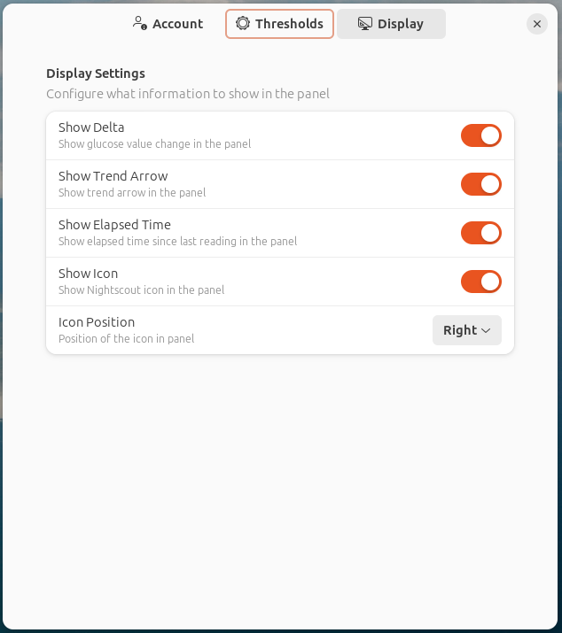

# Nightscout CGM Monitor GNOME Extension

A GNOME Shell extension that displays real-time blood glucose levels from Nightscout in your system panel. Monitor your CGM data directly from your desktop with customizable alerts and visual indicators.



 

## Features

- Real-time glucose level display in the GNOME top panel
- Customizable high/low glucose thresholds 
- Visual indicators with configurable colors
- Trend arrows showing glucose rate of change
- Delta values showing glucose changes
- Elapsed time since last reading
- Quick access menu with detailed information
- Configurable refresh interval
- Sound alerts for out-of-range values
- Customizable panel icon position

## Requirements

- GNOME Shell 45+
- Active Nightscout site
- Valid Nightscout API token

## Installation

### From GNOME Extensions Website
1. Visit [GNOME Extensions](https://extensions.gnome.org) and search for "Nightscout CGM Monitor"
2. Click "Install" to add the extension to your system
3. Enable the extension using the toggle switch

### Manual Installation
1. Clone this repository:
   ```bash
   git clone https://github.com/faymaz/nightscout
   ```
2. Copy to GNOME extensions directory:
   ```bash
   cp -r nightscout ~/.local/share/gnome-shell/extensions/nightscout@faymaz
   ```
3. Restart GNOME Shell:
   - Press Alt+F2
   - Type 'r'
   - Press Enter
   - For Wayland sessions, you need to log out and log back in.
4. Enable the extension using GNOME Extensions app or over CMD Line
   - Use a tool like `gnome-extensions-app` or `gnome-tweaks` to enable the "Nightscout CGM Monitor" extension.
   - Alternatively, you can enable it via the command line:

     ```bash
     gnome-extensions enable nightscout@faymaz
     ``` 

## Configuration

1. Open GNOME Extensions Settings
2. Find "Nightscout CGM Monitor" in the list
3. Click the settings gear icon to configure:

### Account Settings
- Enter your Nightscout site URL
- Add your API token

### Threshold Settings
- Set glucose thresholds (mg/dL):
  - Urgent High: Default 240
  - High: Default 180  
  - Low: Default 95
  - Urgent Low: Default 80
- Customize colors for each range

### Display Settings
- Toggle delta values
- Toggle trend arrows
- Toggle time display
- Configure icon visibility and position

## Development

Built using GNOME Shell extension technologies:
- GJS (GNOME JavaScript)
- GTK4 and Libadwaita
- GNOME Shell APIs

### Contributing

1. Fork the repository
2. Create a feature branch
3. Commit your changes
4. Push to the branch
5. Create a Pull Request

## License

GPL-3.0 - see [LICENSE](LICENSE) for details

## Support

- Report issues on [GitHub](https://github.com/faymaz/nightscout/issues)
- Visit [Nightscout Documentation](http://nightscout.github.io/) for CGM setup help

## Credits

- Icon: Official Nightscout Logo
- Inspired by [CGM in the Cloud](http://nightscout.github.io/)
